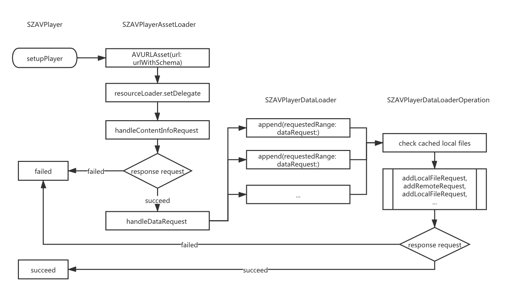

# SZAVPlayer

[](https://cocoapods.org/pods/SZAVPlayer)
[](https://github.com/Carthage/Carthage)
[](https://swift.org/package-manager/)
[](https://cocoapods.org/pods/SZAVPlayer)
[](https://cocoapods.org/pods/SZAVPlayer)

SZAVPlayer是一个轻量级的音视频播放库，基于`AVPlayer`和`AVAssetResourceLoaderDelegate`来实现播放过程和缓存过程。纯Swift实现，同时支持缓存播放和视频画面同步输出（比如可以拿来实现同时绘制到不同View上）。

基于AVPlayer实现音视频播放过程和问题整理在[这里](https://github.com/eroscai/SZAVPlayer/wiki/iOS%E5%9F%BA%E4%BA%8EAVPlayer%E5%AE%9E%E7%8E%B0%E9%9F%B3%E8%A7%86%E9%A2%91%E6%92%AD%E6%94%BE%E5%92%8C%E7%BC%93%E5%AD%98)

## 功能

- [x] 对`AVPlayer`和`AVPlayerItem`进行良好的封装，对外输出使用便捷的几个接口，极大缩减实现音视频播放所要耗费的时间。
- [x] 基于`AVAssetResourceLoaderDelegate`实现了对`AVPlayer`数据加载的完整控制。通过请求过来的Range，有效的使用本地已缓存部分数据，拼接出本地请求和远程请求在最快的时间内进行回应，因此在弱网或者无网情况下也能正常播放已缓存部分数据。
- [x] 支持视频画面的同步输出，可直接绘制在各个不同的视图上。
- [x] 异步加载`AVAsset`，保证加载和切换音视频不会发生卡顿。
- [x] 提供手动清理缓存，同时内部也会根据设定的容量自动进行清理。

## 主流程图



## 提示

> 如果你发现在模拟器上一直播放不正常，可以尝试完全退出模拟器，然后重新开始测试，这个是模拟器自身的BUG。

## 使用

1. 创建播放器并设置代理

    ```swift
    let player = SZAVPlayer()
    player.delegate = self
    
    audioPlayer = player
    ```

2. 使用url进行配置

    ```swift
    // uniqueID is to identify wether they are the same audio. If set to nil will use urlStr to create one.
    let config = SZAVPlayerConfig(urlStr: audio.url, uniqueID: nil)
    audioPlayer.setupPlayer(config: config)
    ```
    
    或
    
    ```swift
    // If you want play video, pass an additional parameter `isVideo`.
    let config = SZAVPlayerConfig(urlStr: video.url, uniqueID: nil, isVideo: true, isVideoOutputEnabled: true/false)
    videoPlayer.setupPlayer(config: config)
    ```

3. 实现 `SZAVPlayerDelegate`。

    ```swift
    extension AudioViewController: SZAVPlayerDelegate {
    
        func avplayer(_ avplayer: SZAVPlayer, refreshed currentTime: Float64, loadedTime: Float64, totalTime: Float64) {
            progressView.update(currentTime: currentTime, totalTime: totalTime)
        }
    
        func avplayer(_ avplayer: SZAVPlayer, didChanged status: SZAVPlayerStatus) {
            switch status {
            case .readyToPlay:
                SZLogInfo("ready to play")
                if playerStatus == .playing {
                    audioPlayer.play()
                }
            case .playEnd:
                SZLogInfo("play end")
                handlePlayEnd()
            case .loading:
                SZLogInfo("loading")
            case .loadingFailed:
                SZLogInfo("loading failed")
            case .bufferBegin:
                SZLogInfo("buffer begin")
            case .bufferEnd:
                SZLogInfo("buffer end")
                if playerStatus == .stalled {
                    audioPlayer.play()
                }
            case .playbackStalled:
                SZLogInfo("playback stalled")
                playerStatus = .stalled
            }
        }
    
        func avplayer(_ avplayer: SZAVPlayer, didReceived remoteCommand: SZAVPlayerRemoteCommand) -> Bool {
            return false
        }
    
    }
    ```
    
4. 切换音视频。

    ```swift
    // The setupPlayer function will automatically determine if it has been setup before. 
    // If it is, it will directly call the replacePalyerItem function to replace the new audio.
    audioPlayer.setupPlayer(config: config)
    ```
    
    或
    
    ```swift
    // or just use this function.
    audioPlayer.replace(urlStr: audio.url, uniqueID: nil)
    ```
    
    these two functions have the same effect.
    
5. 开启视频画面输出。

    - Set `isVideoOutputEnabled ` to `true`.
    
    ```swift
    let config = SZAVPlayerConfig(urlStr: video.url, uniqueID: nil, isVideo: true, isVideoOutputEnabled: true)
    videoPlayer.setupPlayer(config: config)
    ```
    
    - Implement avplayer delegate function.
    
    ```swift
    func avplayer(_ avplayer: SZAVPlayer, didOutput videoImage: CGImage) {
        videoOutputView1.layer.contents = videoImage
    }
    ```
    
    - Call `removeVideoOutput` function when ready to release the player.
    
    ```swift
    videoPlayer.removeVideoOutput()
    ```
    
6. 跳跃到某个特定时间。

    ```swift
    audioPlayer.seekPlayerToTime(time: currentTime, completion: nil)
    ```
    
7. 设定最大缓存容量。

    ```swift
    // Unit: MB, if reached the max size, it will automatically trim the cache.
    SZAVPlayerCache.shared.setup(maxCacheSize: 100)
    ```
    
8. 清理所有缓存。

    ```swift
    SZAVPlayerCache.shared.cleanCache()
    ```

## 示例

The Example project has implemented a complete play example, including play/pause/previous/next/seekToTime/cleanCache, etc. 

To run the example project, clone the repo, and run `pod install` from the Example directory first.

## 要求

- iOS 10.0+
- Swift 5.0+

## 安装

### CocoaPods

SZAVPlayer is available through [CocoaPods](https://cocoapods.org). To install
it, simply add the following line to your Podfile:

```ruby
pod 'SZAVPlayer'
```

### Carthage

[Carthage](https://github.com/Carthage/Carthage) is a decentralized dependency manager that builds your dependencies and provides you with binary frameworks. To integrate SZAVPlayer into your Xcode project using Carthage, specify it in your `Cartfile`:

```ogdl
github "eroscai/SZAVPlayer" ~> 1.1.1
```

### Swift Package Manager

From Xcode 11, you can use [Swift Package Manager](https://swift.org/package-manager/) to add SZAVPlayer to your project.

- Select File > Swift Packages > Add Package Dependency. Enter https://github.com/eroscai/SZAVPlayer.git in the "Choose Package Repository" dialog.
- Add `CoreServices.framework` and `AVFoundation.framework` to your project if not added before. (If anyone knows how to do this automatically, please tell me).

## Author

eroscai, csz0102@gmail.com

## License

SZAVPlayer is available under the MIT license. See the LICENSE file for more info.
